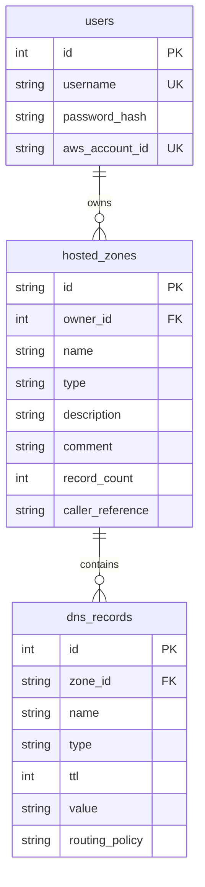

# AWS Route 53 Console Clone

A pixel-perfect, highly responsive clone of the Amazon Route 53 management console. This application simulates the Route 53 user experience, incorporating the AWS Cloudscape Design System look and feel, Hosted Zone CRUD, DNS record type validations, multi-tenant dashboard isolation, and custom safety modal dialogs.

---

## Architecture Overview

The system is structured as a decoupled multi-project client-server application:

### 1. Backend Service (`backend/`)
- **FastAPI**: Asynchronous Python web framework serving the REST API.
- **SQLAlchemy (ORM)**: Translates relational SQLite schemas into Python models.
- **SQLite**: Direct, embedded SQL engine storing users, zones, and records.
- **SHA-256 Auth Backend**: Custom hashing security system implementing OAuth2 Password Bearer flow with signing JWT access tokens.
- **DNS Domain Validator**: Employs built-in python `ipaddress` libraries to inspect record formats (A, AAAA, CNAME, TXT) before committing configurations to database states.

### 2. Frontend Console (`frontend/`)
- **Next.js (App Router)**: React application with TypeScript compilation.
- **Vanilla CSS Modules**: Curated color palettes, layout matrices, and animations matching the AWS Console design.
- **AWS Drawers & Modal Overlays**: Right slide-out panels and custom delete confirmation dialogs (forcing safety strings like typing `"delete"` to confirm).
- **Pagination & Notifications**: Client-side paginators and dismissible warning/success alerts.

---

## Database Schema

The SQLite database (`backend/route53.db`) contains three main tables linked by standard foreign key relationships:



### Table Specifications:
1. **`users`**:
   - `id`: Integer (Primary Key, autoincremented)
   - `username`: String (Unique index, non-nullable)
   - `password_hash`: String (64-character SHA-256 hex string)
   - `aws_account_id`: String (Unique 12-digit AWS identifier)

2. **`hosted_zones`**:
   - `id`: String (Primary Key, generated unique AWS Zone format e.g., `Z2MGR...`)
   - `owner_id`: Integer (Foreign Key referencing `users.id`, cascade-deletes zones if a user profile is removed)
   - `name`: String (Domain name suffix e.g., `example.com.`)
   - `type`: String (`Public` or `Private`)
   - `description`: String (Optional)
   - `comment`: String (Optional)
   - `record_count`: Integer (Tracking records in the zone)
   - `caller_reference`: String (Unique request identity)

3. **`hosted_zones`**:
   - `id`: String (Primary Key, generated unique AWS Zone format e.g., `Z2MGR...`)
   - `owner_id`: Integer (Foreign Key referencing `users.id`, cascade-deletes zones if a user profile is removed)
   - `name`: String (Domain name suffix e.g., `example.com.`)
   - `type`: String (`Public` or `Private`)
   - `description`: String (Optional)
   - `comment`: String (Optional)
   - `record_count`: Integer (Tracking records in the zone)
   - `caller_reference`: String (Unique request identity)

4. **`dns_records`**:
   - `id`: Integer (Primary Key, autoincremented)
   - `zone_id`: String (Foreign Key referencing `hosted_zones.id`, cascade-deletes records if zone is removed)
   - `name`: String (Full record name e.g., `www.example.com.`)
   - `type`: String (`A`, `AAAA`, `CNAME`, `TXT`, `MX`, `NS`, `PTR`, `SRV`, `CAA`)
   - `ttl`: Integer (Time-To-Live in seconds)
   - `value`: String (DNS target parameters, supports multi-line IPs)
   - `routing_policy`: String (Defaults to `"Simple"`)

---

## API Overview

All routes require authentication headers: `Authorization: Bearer <JWT_Token>` (except login and register).

### 1. Authentication Router (`/api/auth`)
- `POST /api/auth/register`: Create a new account. Auto-generates a unique 12-digit `aws_account_id`.
- `POST /api/auth/login`: Authenticate credentials (username/password) and get a signed JWT.
- `GET /api/auth/me`: Fetch the active user's username and `aws_account_id`.

### 2. Hosted Zones Router (`/api/zones`)
- `GET /api/zones`: List hosted zones owned by the current user. Supports query filtering `?name=example`.
- `POST /api/zones`: Create a new hosted zone. Generates the zone and seeds default `NS` and `SOA` records.
- `GET /api/zones/{zone_id}`: Fetch detailed configuration metadata for a zone.
- `PUT /api/zones/{zone_id}`: Update zone `description` and `comment` fields.
- `DELETE /api/zones/{zone_id}`: Remove the zone and cascade-delete its records.

### 3. DNS Records Router (`/api/zones/{zone_id}/records`)
- `GET /api/zones/{zone_id}/records`: Retrieve DNS records inside a zone. Supports querying `?name=www` or `?type=A`.
- `POST /api/zones/{zone_id}/records`: Append a DNS record. Runs type validations (IPv4 formatting, CNAME uniqueness) and increments zone record count.
- `PUT /api/zones/{zone_id}/records/{record_id}`: Modify an existing record's prefix name, TTL, or values. System records block type/name alterations.
- `DELETE /api/zones/{zone_id}/records/{record_id}`: Remove a record. Prevents deleting default `NS` and `SOA` system records.

---

## Setup & Running Instructions

### Prerequisites
- Python 3.10+
- Node.js 18+

### 1. Running the Backend Service
Navigate to the `backend/` directory:
```powershell
cd backend
```

Create and activate a virtual environment:
```powershell
# Create venv
python -m venv .venv

# Activate (Windows PowerShell)
.venv\Scripts\Activate.ps1

# Activate (Unix/macOS)
source .venv/bin/activate
```

Install packages and start the hot-reloading dev server:
```powershell
pip install -r requirements.txt
uvicorn app.main:app --reload
```
*Note: FastAPI automatically spins up SQLite schemas and seeds a default administrative user:*
- **Username**: `admin`
- **Password**: `adminpassword`

### 2. Running the Frontend Console
Navigate to the `frontend/` directory:
```powershell
cd frontend
```

Install node dependencies and launch Next.js in developer mode:
```powershell
npm install
npm run dev
```

Open **[http://localhost:3000](http://localhost:3000)** in your browser, log in with admin (or sign up a new account), and begin configuration!

---
Run Backend
```
cd backend
.venv\Scripts\Activate.ps1
uvicorn app.main:app --reload
```

Run Frontend
```
cd frontend