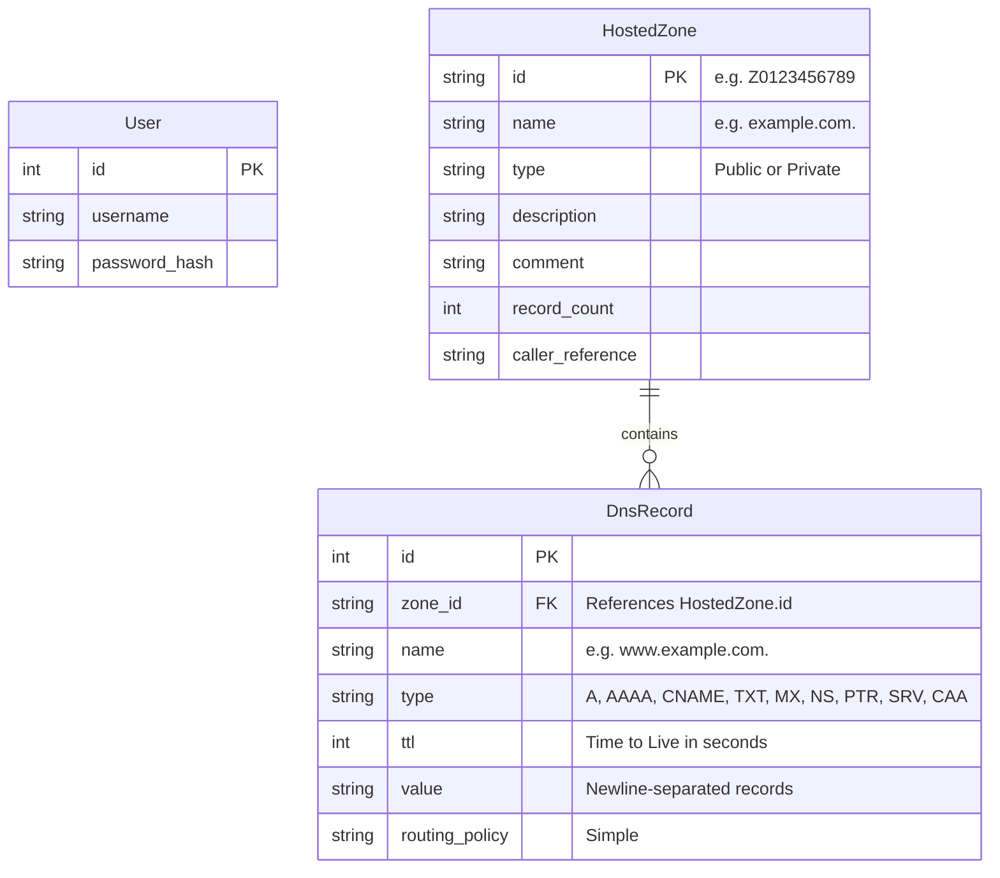

# AWS Route53 Clone Implementation Plan

Build a functional clone of the AWS Route53 web application with persistent storage (SQLite), a FastAPI backend, and a Next.js (TypeScript) frontend. The goal is to recreate the Route53 user experience, styling, and core workflows.

## User Review Required

> [!IMPORTANT]
> **Environment Prerequisites:** We need both Node.js (version 18+) and Python (version 3.10+) to develop and run the application. Since they aren't on the system PATH, we recommend installing them. We can install them using `winget` (Windows Package Manager).
>
> **Styling System:** We propose using Vanilla CSS / CSS Modules to build the AWS-style user interface, matching the AWS Cloudscape Design System. This avoids bloated dependencies and ensures maximum styling fidelity.

## Open Questions

1. **Prerequisite installation:** Would you like me to run `winget` commands to install Node.js and Python for you, or would you prefer to install them manually?
2. **Mock Authentication:** Is a simple username/password mock login with JWT or basic cookie session persistence sufficient? (We will mock IAM and AWS accounts as static selections/profile settings in the top navigation bar).

---

## Proposed Changes

We will create a multi-project layout with `backend/` and `frontend/` in the workspace root.

```
Route53/
├── backend/
│   ├── app/
│   │   ├── database.py       # SQLite connection and session management
│   │   ├── models.py         # SQLAlchemy models for Zones, Records, and Users
│   │   ├── schemas.py        # Pydantic schemas for requests/responses
│   │   ├── auth.py           # Simple mocked authentication endpoints/handlers
│   │   ├── main.py           # FastAPI entrypoint and middleware
│   │   └── routers/
│   │       ├── zones.py      # CRUD for Hosted Zones
│   │       └── records.py    # CRUD for DNS Records
│   ├── requirements.txt
│   └── route53.db            # SQLite database file
├── frontend/
│   ├── src/
│   │   ├── app/              # Next.js App Router (layout, page, login, dashboard)
│   │   ├── components/       # AWS console components (Sidebar, TopNav, Tables, Forms)
│   │   └── styles/           # Global styles and CSS Modules
│   ├── package.json
│   └── tsconfig.json
└── README.md                 # Updated with setup and architecture docs
```

### Database Schema

We will use SQLite with SQLAlchemy.



### Backend (FastAPI + SQLite)

1. **Setup**: Initialize a virtual environment and configure dependencies (`fastapi`, `uvicorn`, `sqlalchemy`, `pydantic`).
2. **Auth API**: Mocked `/api/auth/login` and `/api/auth/logout` endpoints. Return a mock token/cookie.
3. **Hosted Zones CRUD**:
   - `POST /api/zones`: Create zone. Generates a random AWS-like Hosted Zone ID (e.g. `Z08219483A5V2EXAMPLE`) and automatically adds default `NS` and `SOA` records.
   - `GET /api/zones`: Retrieve all zones (supporting search query on domain name, sorting, and pagination).
   - `GET /api/zones/{id}`: Retrieve single zone details.
   - `PUT /api/zones/{id}`: Edit zone comment or description.
   - `DELETE /api/zones/{id}`: Delete zone and all its records.
4. **DNS Records CRUD**:
   - `POST /api/zones/{id}/records`: Add new record with validations based on type.
   - `GET /api/zones/{id}/records`: Get records (with search/filter by record name, record type).
   - `PUT /api/zones/{id}/records/{record_id}`: Edit an existing record.
   - `DELETE /api/zones/{id}/records/{record_id}`: Delete a record.
5. **Bonus / Extras**:
   - `/api/zones/{id}/export`: Export records in BIND zone file format or JSON.
   - `/api/zones/{id}/import`: Parse and import record entries from a BIND zone format text upload.

### Frontend (Next.js + TypeScript)

We will build a high-fidelity AWS Console replica:
1. **Layout**:
   - **AWS Top Navigation Bar**: Dark grey background (`#232f3e`), logo, search bar, profile info with active "AWS Account ID" (mocked), and region dropdown (displays "Global").
   - **Route53 Left Navigation Menu**: Clean left sidebar matching the AWS console styling. Expandable categories: DNS management (Hosted zones), Traffic flow, Health checks, Resolver, etc.
2. **Authentication Page**: A simplified AWS Sign-In page replica.
3. **Hosted Zones View**:
   - A data table with column headers, checkbox selections, search filter, and action buttons ("Create hosted zone", "Delete").
   - Paginated results.
   - Side panel form for "Create hosted zone" matching the AWS slide-out drawer/right side-panel experience.
4. **Hosted Zone Details View**:
   - Displays metadata card at the top.
   - Records list table. Includes tabs/action buttons for "Create record", "Edit record", "Delete record".
   - **Create Record Form / Side Panel**: Fields for Record Name (prefix input + disabled zone name suffix), Record Type dropdown, Value textbox (supporting multiple values as lines), TTL selection, and Routing Policy dropdown.
5. **Mocked Views**: Display "Coming Soon" styling for Dashboard, Health Checks, Resolver, and Traffic Policies.

---

## Verification Plan

### Automated Tests
- Build basic pytest scripts for API verification:
  - Assert authentication states.
  - Assert Hosted Zone CRUD operations.
  - Assert DNS Record CRUD operations and validation logic (e.g. IP checking).
- Build TypeScript linter check for the frontend.

### Manual Verification
- Verify layout responsiveness.
- Perform end-to-end user flows (Login -> Create Hosted Zone -> Create Records -> Search -> Delete Zone -> Logout).
- Verify mock sections load the placeholder view cleanly.
